# System Design Document for Messenger

## Contents

- [1. Introduction](#1-introduction)
- [2. System Architecture](#2-system-architecture)
- [3. Components and Modules](#3-components-and-modules)
- [4. Data Flow](#4-data-flow)
- [5. Technologies Used](#5-technologies-used)
- [6. Database Design](#6-database-design)
- [7. User Authentication and Security](#7-user-authentication-and-security)
- [8. AI Integration](#8-ai-integration)
- [9. Deployment and Hosting](#9-deployment-and-hosting)
- [10. Dependencies and Libraries](#10-dependencies-and-libraries)
- [11. Setup and Installation](#11-setup-and-installation)
- [12. Usage Instructions](#12-usage-instructions)
- [13. Future Enhancements](#13-future-enhancements)
- [14. To Sum up](#14-to-sum-up)

## 1. Introduction

Messenger is a real-time messaging application that allows users to engage in one-on-one or group chats. It also features an AI-powered chatbot for interactive and fun conversations. This document provides an in-depth overview of the system's design and architecture.

## 2. System Architecture

The Messenger application follows a client-server architecture. It consists of the following components:

- **Frontend**: Built using React.js and ChakraUI, responsible for the user interface and interactions.
- **Backend**: Developed using Node.js and Express.js, responsible for handling user requests and managing the application's logic.
- **Database**: MongoDB is used for data storage, including user profiles, chat history, and AI chatbot responses.
- **Real-time Messaging**: Socket.io enables real-time communication between users and facilitates instant message updates.
- **AI Integration**: RapidAPI powers the AI chatbot, allowing users to have dynamic conversations with artificial intelligence.
- **Hosting**: Render hosts the application, ensuring its availability and scalability.

## 3. Components and Modules

The system is divided into various components and modules, including but not limited to:

- User Registration and Authentication
- Messaging Engine for Sending and Receiving Messages
- Group Chat Functionality
- Real-time Message Updates
- AI Chatbot Integration

Each component plays a crucial role in delivering a seamless user experience.

### 3.1. UI/UX Design Using Atomic Design

In designing the user interface of the Messenger application, we followed the principles of Atomic Design. This methodology allows us to break down the interface into smaller components, ensuring consistency, reusability, and scalability. The UI/UX design is structured as follows:

### 3.1.1. Atoms

In the context of the Messenger application's UI/UX design following the Atomic Design methodology, "Atoms" refer to the smallest and fundamental UI components. These atoms are essential building blocks for creating more complex user interface elements. Below are the key "Atoms" utilized in our design:

- **Button**: Buttons are used for various actions and interactions within the application, such as sending messages, submitting forms, or navigating to different sections.

- **Input Fields**: Input fields allow users to enter text, messages, or search queries. They are essential for user interactions, including message composition and search functionality.

- **Labels**: Labels provide context and descriptions for UI elements, helping users understand the purpose of different components.

- **Icons**: Icons are used to represent actions, features, and objects visually. They enhance user comprehension and aid in navigation.

- **Avatars**: Avatars are small user profile images or representations. They are used to identify users within the chat interface and group conversations.

- **Notifications**: Notification icons or indicators inform users about new messages, updates, or events, ensuring they stay informed of important activities.

- **Search Field**: The search field allows users to find other users, group chats, or specific messages quickly. It enhances the user's ability to locate and access content.

By incorporating these "Atoms" into our design, we ensure that the Messenger application's user interface remains consistent, user-friendly, and easily adaptable to meet user needs.

#### 3.1.2. Molecules

The "Molecules" are designed to enhance the usability and functionality of the Messenger application. By combining "Atoms" in various ways, we create more complex and intuitive UI components that contribute to a seamless user experience. For example, Input Feild and Button together, Icon and notification Badges together, etc.,

#### 3.1.3. Organisms

In our UI/UX design using the Atomic Design methodology, one of the significant "Organisms" is the Navigation Bar.

The Navigation Bar is a pivotal and self-contained component within the Messenger application's user interface. It plays a central role in aiding users' navigation and interaction. Comprising several "Molecules" and "Atoms," it provides essential functionality and ensures consistency throughout the application.

Key attributes of the Navigation Bar as an Organism include:

- **Composition**: It is composed of multiple "Molecules," including Search buttons for composing new messages, App logo, and icons for notifications, My Profile and Logout options.

- **Functionality**: The Navigation Bar serves as a hub for crucial user actions such as switching between modes, logging out, and viewing notifications.

- **Consistency**: Its design and layout are consistent throughout the application, ensuring a unified and familiar user experience.

- **Reusability**: Elements within the Navigation Bar, such as buttons and icons, are reusable components that are also used in various other parts of the interface.

#### 3.1.4. Templates

Templates are very concrete and provide context to all these relatively abstract molecules and organisms. Templates are also where clients start seeing the final design in place.

In Messenger App, ChatPage is a template, which has different instances like when no user is selected, when a user is selected, when in user mode etc.,

#### 3.1.5. Pages

Pages represent the complete user interfaces that users interact with. They are constructed by combining templates and organisms to provide a seamless and consistent user experience. Each page is designed to fulfill specific user tasks and requirements.

By adhering to the Atomic Design methodology, we ensure that the Messenger application's user interface is not only visually appealing but also highly organized, efficient, and adaptable. This approach enhances user satisfaction and usability while facilitating future design updates and expansions.

## 4. Data Flow

Data flows within the Messenger system as follows:

- Users register and log in using the authentication system.
- Messages are exchanged in real-time via the messaging engine powered by Socket.io.
- User profiles and chat histories are stored and retrieved from the MongoDB database.
- AI chatbot interactions are facilitated through RapidAPI.

## 5. Technologies Used

The technologies and tools used in the Messenger project include:

- **Frontend**: React.js, ChakraUI
- **Backend**: Node.js, Express.js
- **Database**: MongoDB
- **Real-time Messaging**: Socket.io
- **AI Integration**: RapidAPI
- **Hosting**: Render

## 6. Database Design

The database design includes entities and schemas for user profiles, chats, and messages.

User Schema has the fields: name, email, password, and pic

Chat Schema has the fields: chatName, isGroupChat, users, latest message, and group admin

Message Schema has the fields: sender, content, and chat

## 7. User Authentication and Authorization

In the Messenger application, user authentication and authorization are crucial components to ensure the security and privacy of user data. These mechanisms are implemented using JSON Web Tokens (JWT) and the bcrypt hashing algorithm.

### 7.1. JWT-based Authentication

JSON Web Tokens (JWT) are used for user authentication. When a user registers or logs in, the server generates a unique token and sends it to the client. This token is then included in the headers of subsequent requests to verify the user's identity.

Here's how the JWT-based authentication works:

1. **Token Generation**: Upon successful registration or login, a JWT is generated containing user information.
2. **Token Verification**: When a user makes a request to a protected endpoint (requiring authentication), the token in the request header is verified.
3. **User Identification**: If the token is valid, it is decoded to retrieve the user's identity (typically their user ID), which is used to fetch user details.
4. **Access Control**: The user's access to protected resources is determined based on their role and permissions.

### 7.2. Password Security with bcrypt

To enhance security, user passwords are stored securely using the bcrypt hashing algorithm. Here's how password security is implemented:

1. **Hashing**: When a user registers or updates their password, it is hashed using bcrypt, and the hash is stored in the database. The actual password is never stored.

2. **Comparison**: During login, the provided password is hashed using the same algorithm and compared to the stored hash. If they match, access is granted.

### 7.3. Protecting User Data and Privacy

To protect user data and privacy, several measures are in place:

- **Token Expiry**: JWT tokens have an expiration time to mitigate the risk of stolen tokens.
- **HTTPS**: Communication between the client and server is secured using HTTPS to prevent data interception.
- **Data Encryption**: Sensitive user data, such as passwords, is encrypted before storage.
- **Authorization Middleware**: Protected routes are guarded with an authorization middleware (`protect`) to ensure only authenticated users can access them.
- **User Data Isolation**: Users can only access their own data and chat history.

These security measures collectively ensure that user data remains confidential, and only authorized users can perform specific actions within the Messenger application.

## 8. AI Integration

In Messenger, the ChatGPT AI API from RapidAPI is seamlessly integrated to enhance the user experience. This integration allows users to engage in dynamic and context-aware conversations with an AI chatbot. Here's how it works:

- **User Interaction**: Users can interact with the AI chatbot naturally, just like they would with other users. They can ask questions, seek information, or simply engage in conversations.

- **Personalized Responses**: The AI chatbot provides personalized responses based on user queries and context within the chat. This adds a touch of personalization to the user experience.

- **Conversational Assistance**: The AI chatbot serves as a conversational assistant, assisting users by providing information, answering queries, and engaging in meaningful dialogues.

- **Enhanced User Engagement**: The integration with ChatGPT enriches user engagement within the application. It makes conversations more interactive, engaging, and enjoyable.

- **AI-Powered Features**: The ChatGPT AI API brings AI-powered features to the application, further enhancing the overall user experience.

## 9. Deployment and Hosting

Deployed and Hosted on Render.

## 10. Dependencies and Libraries

- **axios**: A promise-based HTTP client for making requests to external resources.

- **bcryptjs**: A library for hashing and salting passwords to enhance security.

- **cloudinary**: A cloud-based image and video management service, often used for handling media uploads and storage.

- **colors**: A package for adding colored output to the console for improved readability.

- **cors**: A middleware for enabling Cross-Origin Resource Sharing, commonly used to control access to resources from different origins.

- **dotenv**: A library for loading environment variables from a `.env` file into the Node.js process environment.

- **express**: A popular web application framework for building server-side applications and APIs.

- **express-async-handler**: A utility for handling asynchronous errors in Express routes and middleware.

- **jsonwebtoken**: A library for generating JSON Web Tokens (JWTs) used for user authentication.

- **mongoose**: An Object Data Modeling (ODM) library for MongoDB, used for interacting with MongoDB databases.

- **nodemon**: A development utility that automatically restarts the Node.js server when changes are detected in the source code.

- **react-router-dom**: A library for routing in React applications.

- **socket.io**: A library for real-time, bidirectional communication between clients and servers, often used for building chat applications.

- **tough-cookie**: A library for parsing and serializing HTTP cookies, useful for handling cookie-based authentication.

- **unirest**: A library for making HTTP requests in a simple and intuitive way.

- **uuid**: A library for generating universally unique identifiers (UUIDs).

These dependencies play various roles in messenger, such as handling HTTP requests, managing user authentication, facilitating real-time communication, and more. Each serves a specific purpose and contributes to the functionality of Messenger application.

## 11. Setup and Installation

To run the Messenger project locally, follow these steps:

### Clone the Project

```bash
git clone https://github.com/nmscs-21/Messenger_Project
```

### Go to the Project directory

```bash
  cd Messenger_Project
```

### Install dependencies

```bash
    npm install
    cd messenger/
    npm install
```

### Start the Sever

If in messenger, navigate back to the Project directory,

```bash
    cd ..
```

then, Start the server

```bash
    npm run start
```

### Start the Client

Open a new terminal and navigate to messenger directory, and start the client

```bash
    cd messenger/
    npm run start
```

## 12. Usage Instructions

The user interface has been designed with a focus on user-friendliness. To get started, please follow the registration process outlined below:

### Registration and Login

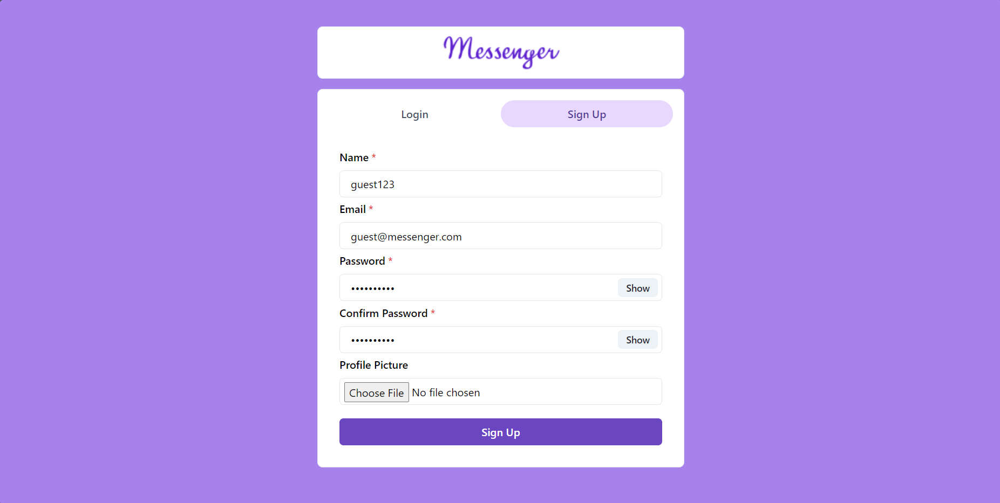


To create an account and start using the Messenger application, please follow these steps:

- 1. Click on "Sign Up" tab on the main screen.
- 2. Complete the registration form by providing your name, email address, and a secure password.
- 3. Upload Profile picture if interested.
- 4. Click the "Sign Up" button to create your account.
- 5. Once registered, you will be directed to the Chat Page.
- 6. Next time, you can use your email and password to log in.

### AI mode

#### Interacting with AI Chatbot

To engage with AI Chatbot, Please follow these steps:

- 1. Click on the "Chat with AI" button


- 2. Enter your query to initiate a conversation with AI

Please note that if you receive a response from the AI in the form of '...', it signifies that the query limit has been reached. In such instances, we kindly request that you try again later.


- 3. While using the AI mode, you will continue to receive notifications from other users. To access these notifications, simply switch back to User Mode.


It's important to note that conversations conducted in AI mode are not stored and will be deleted upon switching to User Mode. This measure is in place to protect your privacy and data security.

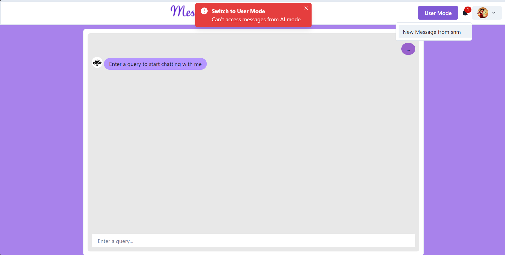

### User mode

#### Chat with other users

To engage with others, Please follow these steps:

- 1. **Search for Users:** Click on the "Search" button.
- 2.  **Find a User:** In the search feild, enter the name or email of the person you wish to chat with and press "Go."

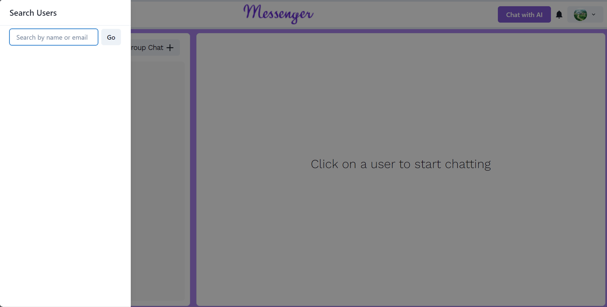

If you are unsure of specific users, you can explore all available users by entering @.

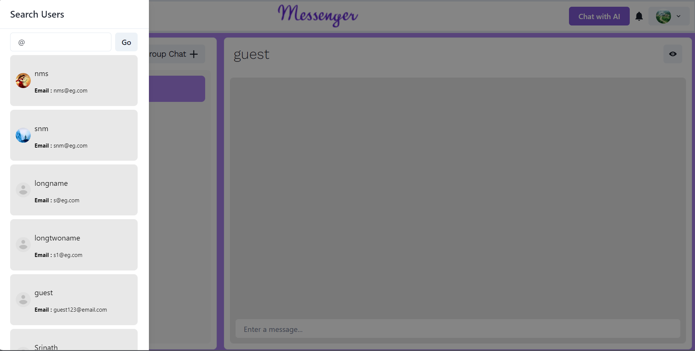

- 3. **Select a User:** Click on the user you would like to chat with, and then use message feild to start your conversation.

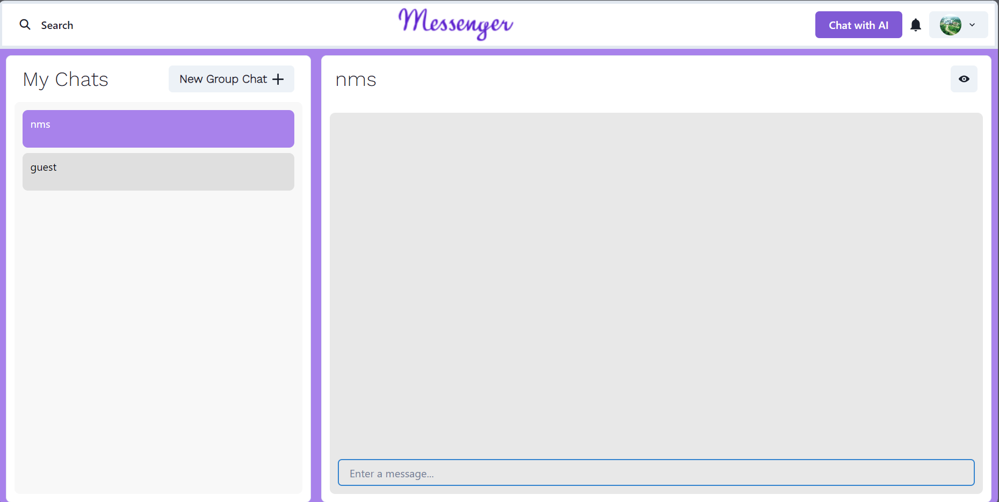


These steps will help you initiate and engage in conversations with other users of the application.

#### Additional Features

##### Notifications

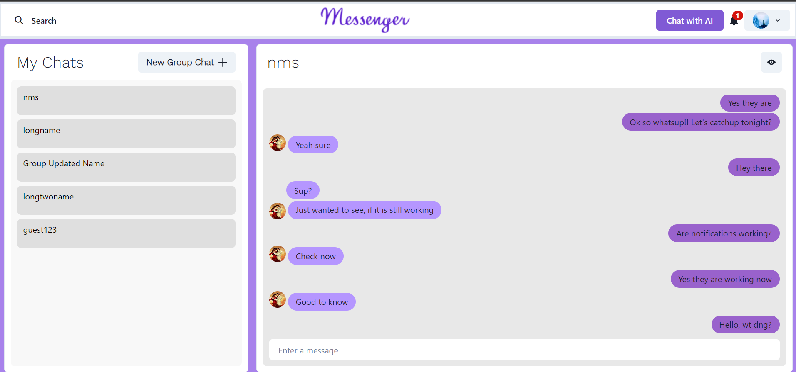

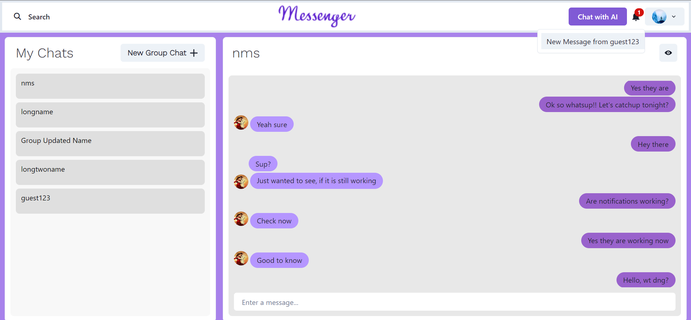

Within the Messenger application, notifications play a pivotal role in keeping users informed about incoming messages from other users. When a message arrives while the user is not actively in the chat, a notification is generated. Clicking on the notification icon allows users to quickly access and engage with the corresponding chat, ensuring timely responses and an uninterrupted chat experience.

##### Group Chat

The Messenger application offers a robust Group Chat feature that enables users to engage in collaborative conversations with multiple participants. This section outlines the key functionalities and interactions related to Group Chat.

###### 1. Create New Group Chat

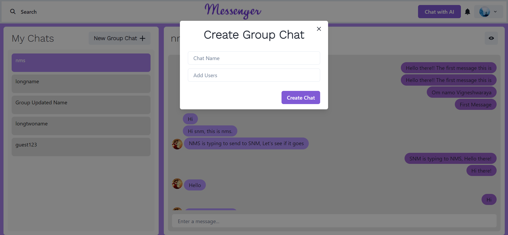

Creating a new Group Chat is a straightforward process, designed to enhance collaboration and communication among users. Users can initiate a new group chat by following these steps:

1. Click on the "Create New Group Chat" button within the application.

2. Enter a unique and descriptive name for the group chat. This name serves as an identifier for the group.

3. Select users from their contacts to add to the group. Users can invite others to join the group chat, fostering inclusivity and teamwork.

4. Confirm the creation of the group chat, and it will be instantly available for group communication.

###### 2. Update the Group Name


Group names play a crucial role in identifying and organizing group chats. Users have the flexibility to update the group name at any time to reflect the evolving nature of their conversations. Here's how it works:

1. Navigate to the group chat for which you want to change the name.

2. Click on the "Edit" or "Update Group Name" option.

3. Enter the new name for the group chat and confirm the change. The updated name will be immediately reflected in the chat interface.

###### 3. Add and Remove Users, Leave the Group

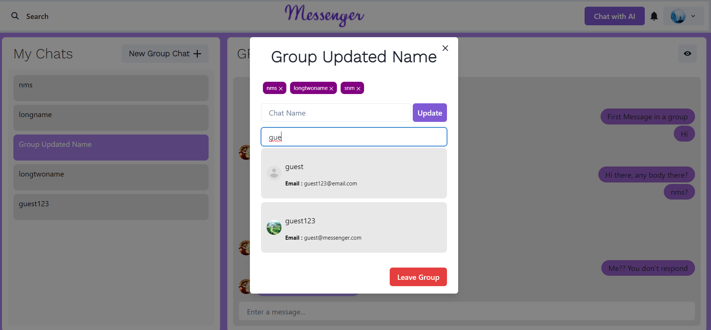

Group dynamics can change, and our Group Chat feature allows for dynamic user management. Users can add, remove, or leave group chats to maintain an optimal group composition. Here's a breakdown of these functionalities:

- **Add Users to the Group**: To expand the group, users with administrative privileges can invite new members by selecting the "Add Users" option within the group chat. Invited users can accept or decline the invitation.

- **Remove Users from the Group**: Administrators can also manage the group's composition by removing participants who are no longer relevant to the conversation. This ensures that group chats remain focused and effective.

- **Leave the Group**: Users have the autonomy to leave group chats when they no longer wish to participate. Leaving a group chat removes the user from the conversation while allowing others to continue their discussions.

These group management capabilities empower users to tailor their group chats to suit their communication needs, whether for work, personal, or social interactions.

**Profile Picture Viewing**

- **Your Profile**: You can easily view your own profile picture by clicking on your avatar.


- **Logout**: You can Logout by clicking on Logout button.

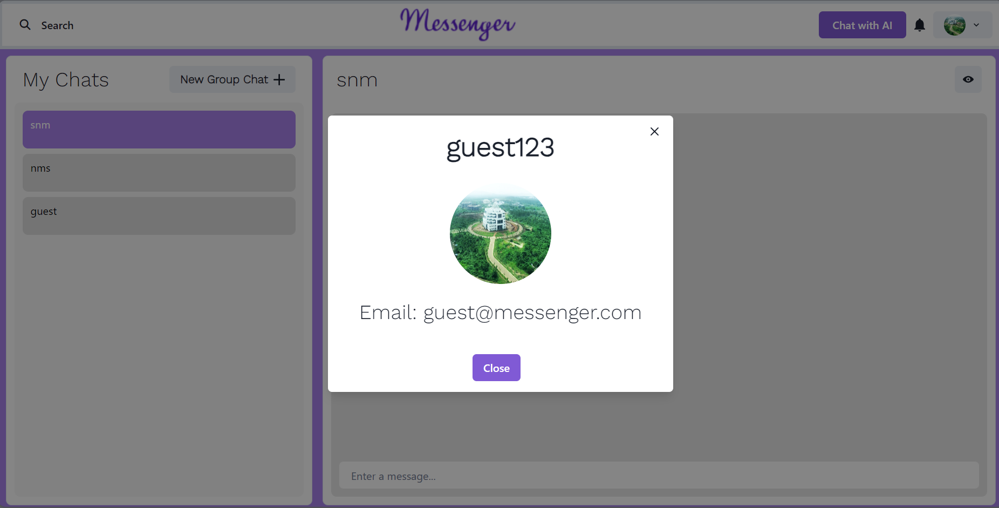

- **Viewing Others' Profiles**: To view the profile pictures of other users, simply click on the eye icon.

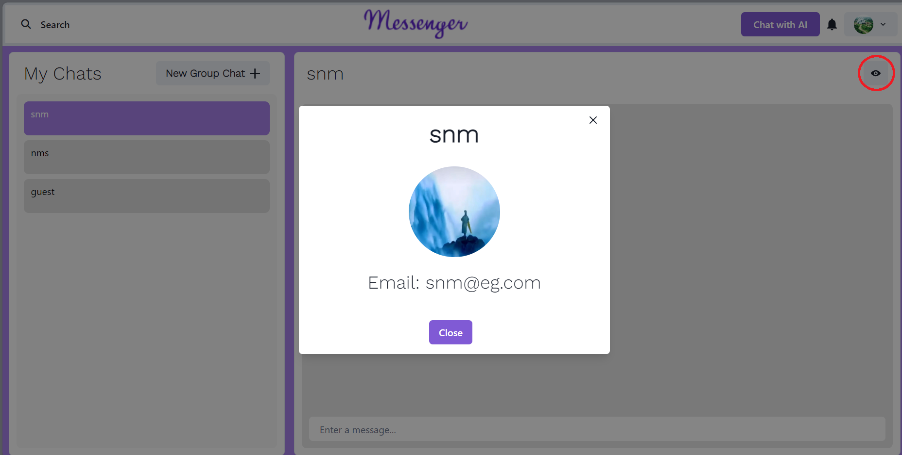

**Typing Indicator**

Stay informed during chats with a typing indicator that lets you know when the other person is composing a message.

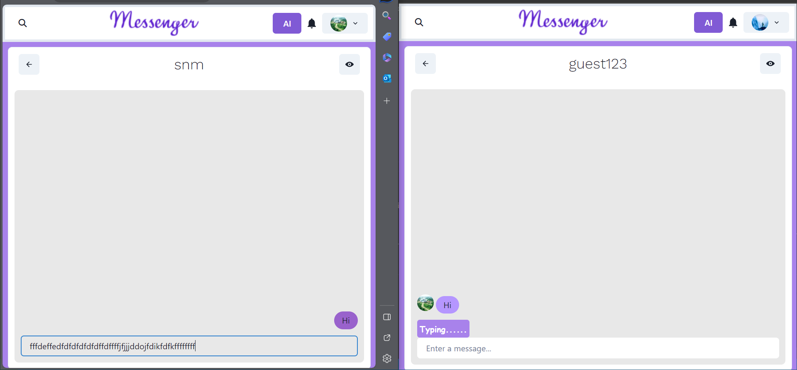

## 13. Future Enhancements

- **1. Force Scrolling Option**: Implement an option for users to enable automatic scrolling in chat conversations, ensuring they always see the latest messages.

- **2. Include Video Calling and Audio Calling Features**: Integrate video and audio calling capabilities, allowing users to have face-to-face conversations within the application.

- **3. Forgot Password**: Implement a "Forgot Password" feature that enables users to reset their passwords securely in case they forget them.

- **4. Message Search and Filtering**: Enhance message search capabilities, allowing users to easily find past conversations or specific content within messages.

- **5. Message Scheduling**: Enable users to schedule messages to be sent at a specific date and time, helping them manage their communication more effectively.

- **6. Message Editing**: Implement the ability for users to edit sent messages to correct typos or update information without having to send a new message.

- **7. User Notifications**: Enhance the notification system to include message delivery and read timestamps, providing users with insights into when their messasges were delivered and read by recipients.

- **8. Change Profile Picture**: Allow users to change their profile pictures, giving them more control over their personalization within the application.

- **9. Message Reactions**: Enable users to react to messages with emojis, adding a layer of expressiveness to their conversations.

- **10. Message Pinning**: Allow users to pin important messages or conversations for quick access.

- **11. Dark Mode**: Introduce a dark mode option for users who prefer a darker user interface, improving usability in low-light environments.

- **12. Integration with Third-party Services**: Explore integrations with popular third-party services like Google Drive, Dropbox, or Trello to enhance collaboration within chats.

- **13. Message Translation**: Add a feature to automatically translate messages in different languages, promoting global communication.

## 14. To Sum Up

The Messenger application is a comprehensive and well-designed real-time communication platform for individual and group messaging needs. It combines cutting-edge technologies, user-centric design principles, and a strong focus on security to deliver an exceptional user experience.

Users can seamlessly switch between User Mode and AI Mode to interact with both human contacts and an AI chatbot, enhancing their conversational experiences.

The Atomic Design methodology underpins the application's user interface, ensuring consistency, reusability, and scalability of UI components. This design approach, combined with user-friendly features such as profile picture viewing, typing indicators, and group chat management, makes Messenger a user-centric and intuitive platform.

The future roadmap includes additional features, such as video and audio calling features, message scheduling, message reactions, and integration with third-party services, to further elevate the user experience and keep the application at the forefront of modern messaging platforms.

Overall, Messenger is not just a messaging tool but a dynamic and evolving platform designed to foster meaningful connections and efficient communication.
