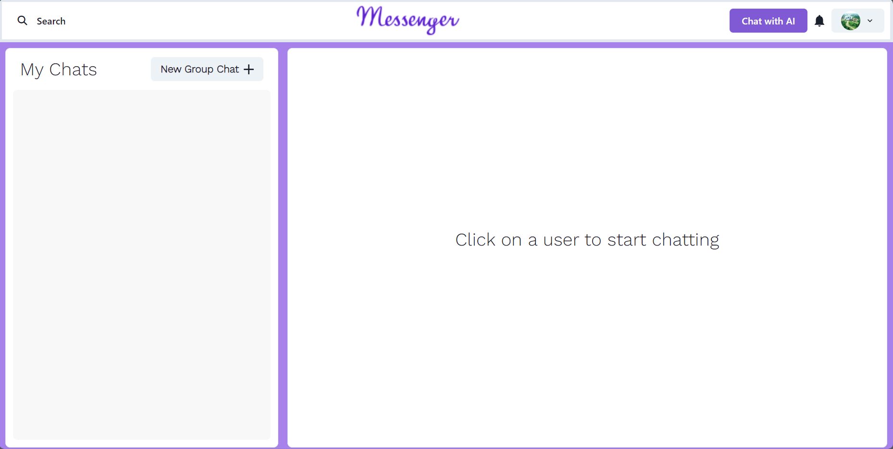
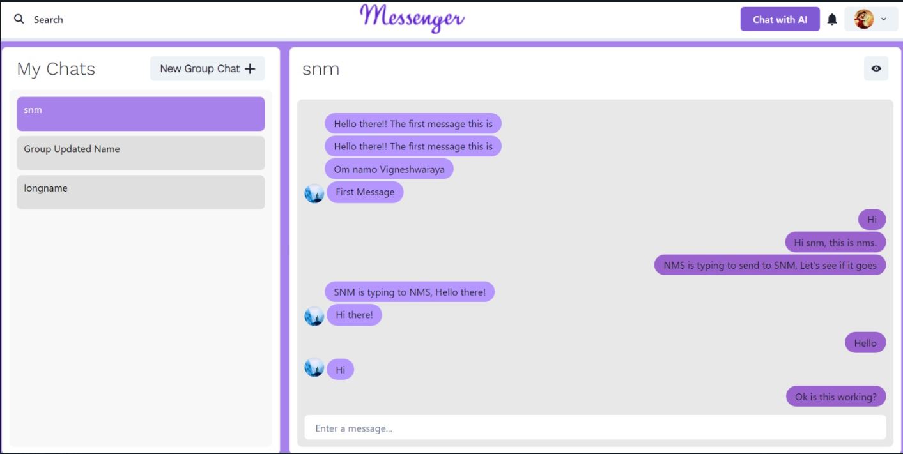
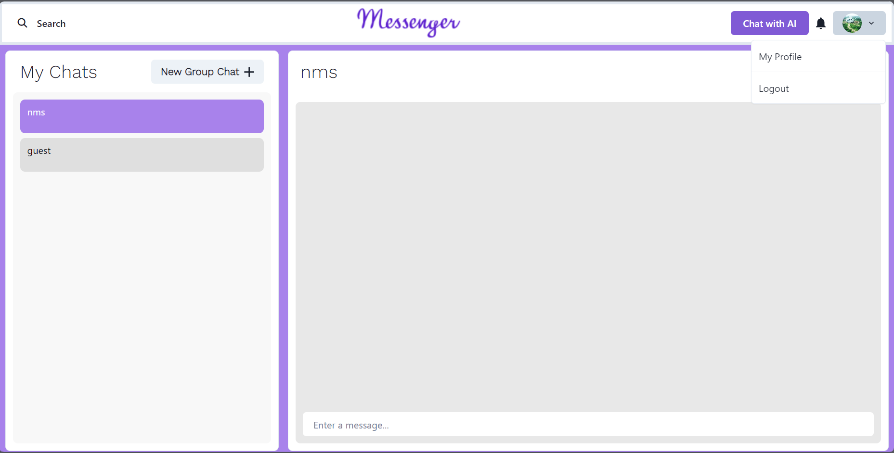

# System Design Document for Messenger

## Table of Contents

- [1. Introduction](#1-introduction)
- [2. System Architecture](#2-system-architecture)
- [3. Components and Modules](#3-components-and-modules)
- [4. Data Flow](#4-data-flow)
- [5. Technologies Used](#5-technologies-used)
- [6. Database Design](#6-database-design)
- [7. User Authentication and Security](#7-user-authentication-and-security)
- [8. AI Integration](#8-ai-integration)
- [9. Deployment and Hosting](#9-deployment-and-hosting)
- [10. Dependencies and Libraries](#10-dependencies-and-libraries)
- [11. Setup and Installation](#11-setup-and-installation)
- [12. Usage Instructions](#12-usage-instructions)
- [13. Future Enhancements](#15-future-enhancements)
- [14. Contributors](#16-contributors)
- [15. References](#17-references)

## 1. Introduction

Messenger is a real-time messaging application that allows users to engage in one-on-one or group chats. It also features an AI-powered chatbot for fun and interactive conversations. This document provides an in-depth overview of the system's design and architecture.

## 2. System Architecture

The Messenger application follows a client-server architecture. It consists of the following components:

- **Frontend**: Built using React.js and ChakraUI, responsible for the user interface and interactions.
- **Backend**: Developed using Node.js and Express.js, responsible for handling user requests and managing the application's logic.
- **Database**: MongoDB is used for data storage, including user profiles, chat history, and AI chatbot responses.
- **Real-time Messaging**: Socket.io enables real-time communication between users and facilitates instant message updates.
- **AI Integration**: RapidAPI powers the AI chatbot, allowing users to have dynamic conversations with artificial intelligence.
- **Hosting**: Render hosts the application, ensuring its availability and scalability.

## 3. Components and Modules

The system is divided into various components and modules, including but not limited to:

- User Registration and Authentication
- Messaging Engine for Sending and Receiving Messages
- Group Chat Functionality
- Real-time Message Updates
- AI Chatbot Integration

Each component plays a crucial role in delivering a seamless user experience.

## 4. Data Flow

Data flows within the Messenger system as follows:

- Users register and log in using the authentication system.
- Messages are exchanged in real-time via the messaging engine powered by Socket.io.
- User profiles and chat histories are stored and retrieved from the MongoDB database.
- AI chatbot interactions are facilitated through RapidAPI.

## 5. Technologies Used

The technologies and tools used in the Messenger project include:

- **Frontend**: React.js, ChakraUI
- **Backend**: Node.js, Express.js
- **Database**: MongoDB
- **Real-time Messaging**: Socket.io
- **AI Integration**: RapidAPI
- **Hosting**: Render

## 6. Database Design

The database design includes collections and schemas for user profiles, chats, and messages.

## 7. User Authentication and Authorization

In the Messenger application, user authentication and authorization are crucial components to ensure the security and privacy of user data. These mechanisms are implemented using JSON Web Tokens (JWT) and the bcrypt hashing algorithm.

### 7.1. JWT-based Authentication

JSON Web Tokens (JWT) are used for user authentication. When a user registers or logs in, the server generates a unique token and sends it to the client. This token is then included in the headers of subsequent requests to verify the user's identity.

Here's how the JWT-based authentication works:

1. **Token Generation**: Upon successful registration or login, a JWT is generated containing user information.
2. **Token Verification**: When a user makes a request to a protected endpoint (requiring authentication), the token in the request header is verified.
3. **User Identification**: If the token is valid, it is decoded to retrieve the user's identity (typically their user ID), which is used to fetch user details.
4. **Access Control**: The user's access to protected resources is determined based on their role and permissions.

### 7.2. Password Security with bcrypt

To enhance security, user passwords are stored securely using the bcrypt hashing algorithm. Here's how password security is implemented:

1. **Hashing**: When a user registers or updates their password, it is hashed using bcrypt, and the hash is stored in the database. The actual password is never stored.
2. **Comparison**: During login, the provided password is hashed using the same algorithm and compared to the stored hash. If they match, access is granted.

### 7.3. Protecting User Data and Privacy

To protect user data and privacy, several measures are in place:

- **Token Expiry**: JWT tokens have an expiration time to mitigate the risk of stolen tokens.
- **HTTPS**: Communication between the client and server is secured using HTTPS to prevent data interception.
- **Data Encryption**: Sensitive user data, such as passwords, is encrypted before storage.
- **Authorization Middleware**: Protected routes are guarded with an authorization middleware (`protect`) to ensure only authenticated users can access them.
- **User Data Isolation**: Users can only access their own data and chat history.

These security measures collectively ensure that user data remains confidential, and only authorized users can perform specific actions within the Messenger application.

## 8. AI Integration

In Messenger, the ChatGPT AI API from RapidAPI is seamlessly integrated to enhance the user experience. This integration allows users to engage in dynamic and context-aware conversations with an AI chatbot. Here's how it works:

- **User Interaction**: Users can interact with the AI chatbot naturally, just like they would with other users. They can ask questions, seek information, or simply engage in conversations.

- **Personalized Responses**: The AI chatbot provides personalized responses based on user queries and context within the chat. This adds a touch of personalization to the user experience.

- **Conversational Assistance**: The AI chatbot serves as a conversational assistant, assisting users by providing information, answering queries, and engaging in meaningful dialogues.

- **Enhanced User Engagement**: The integration with ChatGPT enriches user engagement within the application. It makes conversations more interactive, engaging, and enjoyable.

- **AI-Powered Features**: The ChatGPT AI API brings AI-powered features to the application, further enhancing the overall user experience.

## 9. Deployment and Hosting

Deployed and Hosted on Render.

## 10. Dependencies and Libraries

- **axios**: A promise-based HTTP client for making requests to external resources.

- **bcryptjs**: A library for hashing and salting passwords to enhance security.

- **cloudinary**: A cloud-based image and video management service, often used for handling media uploads and storage.

- **colors**: A package for adding colored output to the console for improved readability.

- **cors**: A middleware for enabling Cross-Origin Resource Sharing, commonly used to control access to resources from different origins.

- **dotenv**: A library for loading environment variables from a `.env` file into the Node.js process environment.

- **express**: A popular web application framework for building server-side applications and APIs.

- **express-async-handler**: A utility for handling asynchronous errors in Express routes and middleware.

- **jsonwebtoken**: A library for generating JSON Web Tokens (JWTs) used for user authentication.

- **mongoose**: An Object Data Modeling (ODM) library for MongoDB, used for interacting with MongoDB databases.

- **nodemon**: A development utility that automatically restarts the Node.js server when changes are detected in the source code.

- **react-router-dom**: A library for routing in React applications.

- **socket.io**: A library for real-time, bidirectional communication between clients and servers, often used for building chat applications.

- **tough-cookie**: A library for parsing and serializing HTTP cookies, useful for handling cookie-based authentication.

- **unirest**: A library for making HTTP requests in a simple and intuitive way.

- **uuid**: A library for generating universally unique identifiers (UUIDs).

These dependencies play various roles in messenger, such as handling HTTP requests, managing user authentication, facilitating real-time communication, and more. Each serves a specific purpose and contributes to the functionality of Messenger application.

## 11. Setup and Installation

To run the Messenger project locally, follow these steps:

### Clone the Project

```bash
git clone https://github.com/nmscs-21/Messenger_Project
```

### Go to the Project directory

```bash
  cd Messenger_Project
```

### Install dependencies

```bash
    npm install
    cd messenger/
    npm install
```

### Start the Sever

If in messenger, navigate back to the Project directory,

```bash
    cd ..
```

then, Start the server

```bash
    npm run start
```

### Start the Client

Open a new terminal and navigate to messenger directory, and start the client

```bash
    cd messenger/
    npm run start
```

## 12. Usage Instructions

The user interface has been designed with a focus on user-friendliness. To get started, please follow the below registration process outlined below:

### Registration and Login


To create an account and start using the Messenger application, please follow these steps:

- 1. Click on "Sign Up" tab on the main screen.
- 2. Complete the registration form by providing your name, email address, and a secure password.
- 3. Upload Profile picture if interested.
- 4. Click the "Sign Up" button to create your account.
- 5. Once registered, you will be directed to the Chat Page.
- 6. Next time, you can use your email and password to log in.

### AI mode

#### Interacting with AI Chatbot

To engage with AI Chatbot, Please follow these steps:

- 1. Click on the "Chat with AI" button



- 2. Enter your query to initiate a conversation with AI

Please note that if you receive a response from the AI in the form of '...', it signifies that the query limit has been reached. In such instances, we kindly request that you try again later.


- 3. While using the AI mode, you will continue to receive notifications from other users. To access these notifications, simply switch back to User Mode.


It's important to be aware that conversations conducted in AI mode are not stored and will be deleted upon switching to User Mode. This measure is in place to protect your privacy and data security.


### User mode

#### Chat with other users

To engage with others, Please follow these steps:

- 1. **Search for Users:** Click on the "Search" button.
- 2.  **Find a User:** In the search feild, enter the name or email of the person you wish to chat with and press "Go."


If you are unsure of specific users, you can explore all available users by entering @.


- 3. **Select a User:** Click on the user you would like to chat with, and then use message feild to start your conversation.




These steps will help you initiate and engage in conversations with other users of the application.

#### Additional Features

**Profile Picture Viewing**

- **Your Profile**: You can easily view your own profile picture by clicking on your avatar.




- **Viewing Others' Profiles**: To view the profile pictures of other users, simply click on their avatars.


**Typing Indicator**

Stay informed during chats with a typing indicator that lets you know when the other person is composing a message.


## 13. Future Enhancements

- **1. Force Scrolling Option**: Implement an option for users to enable automatic scrolling in chat conversations, ensuring they always see the latest messages.

- **2. Include Video Calling and Audio Calling Features**: Integrate video and audio calling capabilities, allowing users to have face-to-face conversations within the application.

- **3. Forgot Password**: Implement a "Forgot Password" feature that enables users to reset their passwords securely in case they forget them.

- **4. Message Search and Filtering**: Enhance message search capabilities, allowing users to easily find past conversations or specific content within messages.

- **5. Message Scheduling**: Enable users to schedule messages to be sent at a specific date and time, helping them manage their communication more effectively.

- **6. Message Editing**: Implement the ability for users to edit sent messages to correct typos or update information without having to send a new message.

- **7. User Notifications**: Enhance the notification system to include message delivery and read timestamps, providing users with insights into when their messasges were delivered and read by recipients.

- **8. Change Profile Picture**: Allow users to change their profile pictures, giving them more control over their personalization within the application.

- **9. Message Reactions**: Enable users to react to messages with emojis, adding a layer of expressiveness to their conversations.

- **10. Message Pinning**: Allow users to pin important messages or conversations for quick access.

- **11. Dark Mode**: Introduce a dark mode option for users who prefer a darker user interface, improving usability in low-light environments.

- **12. Integration with Third-party Services**: Explore integrations with popular third-party services like Google Drive, Dropbox, or Trello to enhance collaboration within chats.

- **13. Message Translation**: Add a feature to automatically translate messages in different languages, promoting global communication.

## 14. Contributors

- Mohan Sai Naguru
- Role: Full-stack Developer
- Contributions: Developed the project based on external resources, fixed bugs, and integrated AI functionality.
